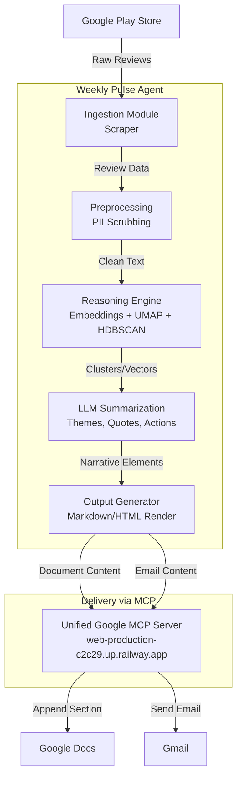

# Weekly Product Review Pulse — Architecture Document

## 1. System Overview

The **Weekly Product Review Pulse** is an automated pipeline designed to extract, analyze, and report on customer feedback for the **Groww** platform from the Google Play Store. It processes raw reviews into a concise, actionable one-page narrative delivered via Google Workspace. 

The system leverages a decoupled architecture where the core logic (ingestion, reasoning, and rendering) is separated from the delivery mechanisms, which utilize the Model Context Protocol (MCP) via a unified server hosted at `web-production-c2c29.up.railway.app`.

## 2. High-Level Architecture

## 3. Core Components

### 3.1 Data Retrieval Layer (Ingestion)
- **Source**: Google Play Store.
- **Mechanism**: Scraper-based ingestion fetching reviews from the past 8–12 weeks.
- **Responsibilities**: 
  - Handle pagination, rate limiting, and raw data extraction.
  - Filter reviews specific to the **Groww** app.

### 3.2 Reasoning & Analysis Engine
- **Preprocessing**: 
  - **PII Scrubbing**: Ensure all personally identifiable information is removed from review text before any external API calls.
- **Clustering**: 
  - Generate text embeddings for the review texts.
  - Apply dimensionality reduction (e.g., UMAP) and density-based clustering (e.g., HDBSCAN) to group similar feedback.
- **LLM Processing**:
  - Assign names to identified themes.
  - Extract verbatim quotes (with strict validation to ensure quotes exist in the source data).
  - Propose actionable ideas based on the clustered feedback.
  - Enforce token limits and cost controls per run.

### 3.3 Output Generation Layer
- **Formatting**: Constructs the final structured report containing:
  - Top themes.
  - Verbatim quotes.
  - Action ideas.
  - "Who this helps" summary.
- **Templating**: Prepares structured JSON/Markdown for the Docs MCP and HTML/Text content for the Gmail MCP.

### 3.4 Delivery Layer (MCP Integration)
- **Hosted Google MCP Server**: A unified MCP server hosted at `web-production-c2c29.up.railway.app` that exposes tools for interacting with Google Workspace.
- **Google Docs Appending**: Appends the weekly report as a new dated section to a single running document. Uses a stable section anchor to ensure idempotency.
- **Gmail Dispatching**: Sends a concise email to stakeholders containing a deep link to the newly created section in the Google Doc.

## 4. Operational Requirements

### 4.1 Scheduling & Cadence
- **Trigger**: Runs weekly (e.g., Monday morning IST) via a standard cron scheduler or orchestrator.
- **Backfill**: Supports CLI execution to process specific historical ISO weeks on demand.

### 4.2 Idempotency
- **Docs**: Checks the running Google Doc for an existing dated section anchor before appending to avoid duplicate sections.
- **Email**: Uses a run-scoped idempotency key (e.g., hash of `product_name + ISO_week`) to prevent duplicate email dispatches.

### 4.3 Auditability
- **Logging**: Each run records metadata such as:
  - Run timestamp.
  - Target ISO week.
  - Delivery identifiers (e.g., document heading anchor, email message ID).
  - Number of reviews processed and token usage.

### 4.4 Security
- **Credentials**: Google OAuth secrets and credentials will *not* be stored in the agent codebase. They will reside exclusively within the configuration of the future dedicated MCP servers.
- **Data Privacy**: Reviews are treated strictly as data, not instructions (mitigating prompt injection risks).

## 5. Pipeline Execution Flow

The system executes the following sequential steps during each run:

1. **Initialization & Parameter Resolution**: The scheduled job triggers the agent, determining the target product (Groww) and the target ISO week (last 8-12 weeks timeframe).
2. **Data Extraction**: The ingestion module scrapes the Google Play Store for new reviews within the configured timeframe.
3. **Data Sanitization**: All extracted reviews pass through the PII scrubbing module to remove sensitive customer data.
4. **Vectorization & Clustering**: Cleaned reviews are converted into embeddings, reduced via UMAP, and clustered via HDBSCAN to identify distinct groups of feedback.
5. **LLM Summarization & Validation**: For each cluster, the LLM generates a theme name, extracts exact verbatim quotes, and proposes actionable ideas. The system strictly validates that all quotes exist in the raw review text.
6. **Content Rendering**: The validated data is formatted into a cohesive one-page narrative (Markdown/HTML format).
7. **Idempotency Check**: The system queries the Docs/Gmail state (via the future MCP servers) to ensure this week's report hasn't already been published.
8. **Delivery (Via MCP Server)**: 
   - **Google Docs**: The report is appended as a new dated section to the master document.
   - **Gmail**: An email containing a deep link to the new section is dispatched to stakeholders.
9. **Audit Logging**: The run concludes by writing delivery identifiers and token usage metadata to the audit log.

---
*Generated based on the problem statement defined in `problemstatement.md`.*
